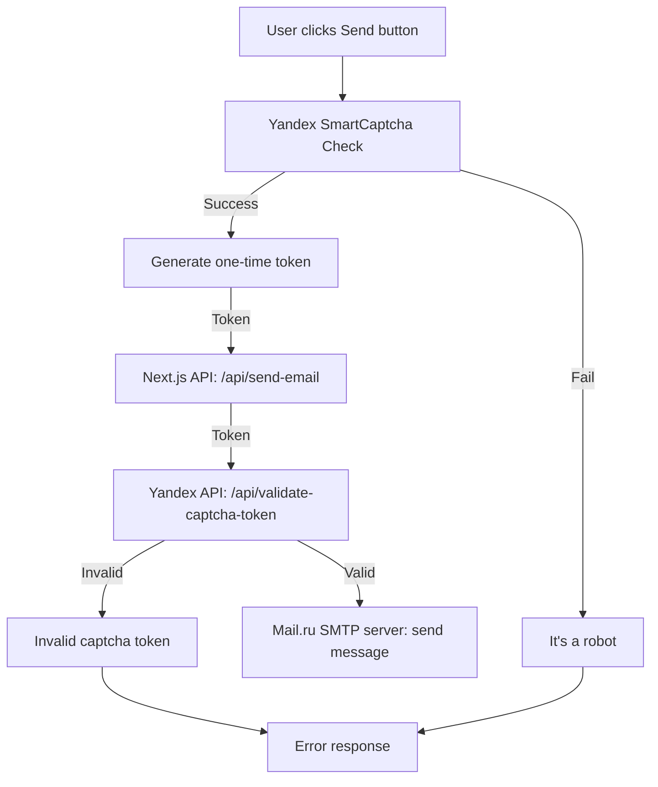

# 002: Ensuring Secure Data Processing in Forms When Handling Personal Data in Russia.

## Status
Accepted

## Accepted
It is necessary to ensure secure data processing in forms when handling personal data, in compliance with legal requirements and to protect the system from automated attacks. The form should only be displayed to users from Russia.

## Decision
### Personal Data Processing
1. Explicit consent for personal data processing is required, with a checkbox placed next to the text:
"I consent to the processing of my personal data ...".
2. The consent checkbox must not be pre-checked automatically.
3. The form must not be submitted without the consent checkbox checked.
4. A link to the document containing the privacy policy and personal data processing terms must be present.

Pros:
- Transparency and compliance with legal requirements
- Clear proof of obtained consent 

### Architectural solution


#### Protection Against Automated Attacks (Yandex SmartCaptcha)

To protect against automated threats (including DDoS, bot attacks, mass fake consents, and request forgery), SmartCaptcha with two-level protection has been added:

- **On the client side** — an invisible captcha that analyzes suspicious activity and, if something looks suspicious, gives a task to prove the user is human. It usually does not affect normal users.
- **On the server side** — token validation through the Yandex API.

This architecture completely stops fake requests sent through `curl`, `Postman`, or any other tools for automating HTTP requests. Even if an attacker intercepts the token, it is one-time only and cannot be used again.

Yandex SmartCaptcha provides a comprehensive guide on creating and adding captcha to a website, which can be found [here](https://yandex.cloud/ru/docs/smartcaptcha/quickstart#node_1)

>The guide above provides an example for vanilla JS only. In the personal account of the Yandex SmartCaptcha service, there is a code example for React. To access it, you need to click the "Connect" button in the top right corner.


#### Sending Emails
We use mail.ru SMTP, more detailed setup instructions can be found [here](https://help.mail.ru/mail/login/mailer/#setup).

1. After filling out the form the endpoint "/api/SendEmail" is called, which accepts the following parameters:

```js
 {
    to: 'targetEmail',
    subject: `yourSubject`,
    message: `yourMessage`,
    html: 'html',
    token: 'dD0xNzgwMzAyNTY0O2k...'
 }
```

2. After successfully verifying the captcha, the [Nodemailer](https://nodemailer.com/) library is used inside this endpoint, which provides methods for creating a `transporter` with the following parameters:

```js
 {
    host: `smtp.mail.ru`,
    port: 465,
    secure: true,
    auth: {
       user: yourEmail,
       pass: yourServicePassword,
    },
 }
```

3. `The transporter.sendEmail()` method is called, which sends the message to the specified email address (the `to` parameter).

Advantages:
- Free
- Easy to configure

## Displaying Form Only to Users from Russia
Because the form uses Russian services for captcha and sending messages, it should only be displayed to users from Russia.

For this, the standard JS tool [Geolocation API](https://developer.mozilla.org/ru/docs/Web/API/Geolocation_API/Using_the_Geolocation_API)is used. It allows you to obtain the user's coordinates, but to determine the user's country, these coordinates need to be geocoded. For this purpose, the [coordinate_to_country](https://www.npmjs.com/package/coordinate_to_country) package is used.
