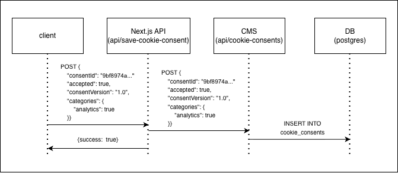

# 003: Storage and collection of cookie consent data

## Status
Proposed

## Context
Необходимо собирать и хранить данные о согласии на обработку cookie в соответствии с GDPR.

## Decision
Хранить данные о согласии в БД (postgres) в уже готовой базе данных для CMS Stapi. И использовать интерфейс CMS для управления записями о согласии.

### Схема хранения (таблица `cookie_consents`)

| Поле | Тип | Описание |
|------|-----|----------|
| `consent_id` | UUID | Идентификатор пользователя (генерируется на клиенте). Необходим на случай если пользователь обратиться с просьбой удалить данные о нем из БД. |
| `created_at` | timestamp | Время согласия (устанавливается CMS автоматически при создании записи). |
| `consent_version` | string | Версия Политики конфиденциальности на которую согласился пользователь |
| `categories` | JSON | Разрешенные категории cookies (например: `{"analytics": true, "marketing": false}`). |

### Генерация consent_id
Идентификатор `consent_id` генерируется только после получения согласия пользователя на обработку cookie. Для его генерации используется метод `crypto.randomUUID()`, который создаёт случайный UUID. Сгенерированный UUID сохраняется в localStorage браузера пользователя. Это обеспечивает бессрочное хранение идентификатора (если только пользователь не очистит localStorage вручную).

### Процедура удаления по запросу пользователя
1. Пользователь отправляет запрос на почту с просьбой удаления данных.
2. Мы запрашиваем consentId из localStorage для идентификации пользователя.
2. Если `consent_id` есть в localStorage → поиск и удаление в интерфейсе CMS.
3. Если `consent_id` отсутствует:
   - Пытаемся идентифицировать запись по времени.
   - При невозможности идентификации — отказываем с объяснением причины.

## Consequences:

### Advantages:
- Соблюдение требований GDPR.
- Использование готовой инфраструктуры.
- Интерфейс CMS позволит легко искать и удалять запись при необходимости.
- Маленький риск потери данных, т.к у нас есть рабочий механизм резервного копирования БД.

### Disadvantages:
- Невозможность 100% идентификации при потере `consent_id` из-за отсутствия других способов идентификации.
- Зависимость от CMS.

## Architectural solution

1. **Client (Next.js)** — собирает согласие, генерирует UUID `consent_id`.
2. **API (Next.js)** — `/api/save-cookie-consent` эндпоинт для секретного вызова API CMS, вызывается только после согласия пользователя на обработку cookie.
3. **CMS (Stapi)** — коллекция `cookie_consents` с автоматическими CRUD-эндпоинтами, записывает данные в БД.

## Подумать над безопасностью (сейчас можно спокойно вызывать эндпоинт с postman, есть риск DDoS)

## Alternatives

## Хранение данных в JSON файле
Вместо хранения данных в БД, хранить их в локальном JSON файле и дописывать данные туда.

Advantages:
- Нет зависимости от CMS и БД.

Disadvantages:
- Отсутствие удобного интерфейса.
- Риск потери данных больше чем в БД.
- Необходимо настраивать механизм резервного копирования.
- Необходимо продумывать и настраивать запись данных в удобочитаемом формате.

