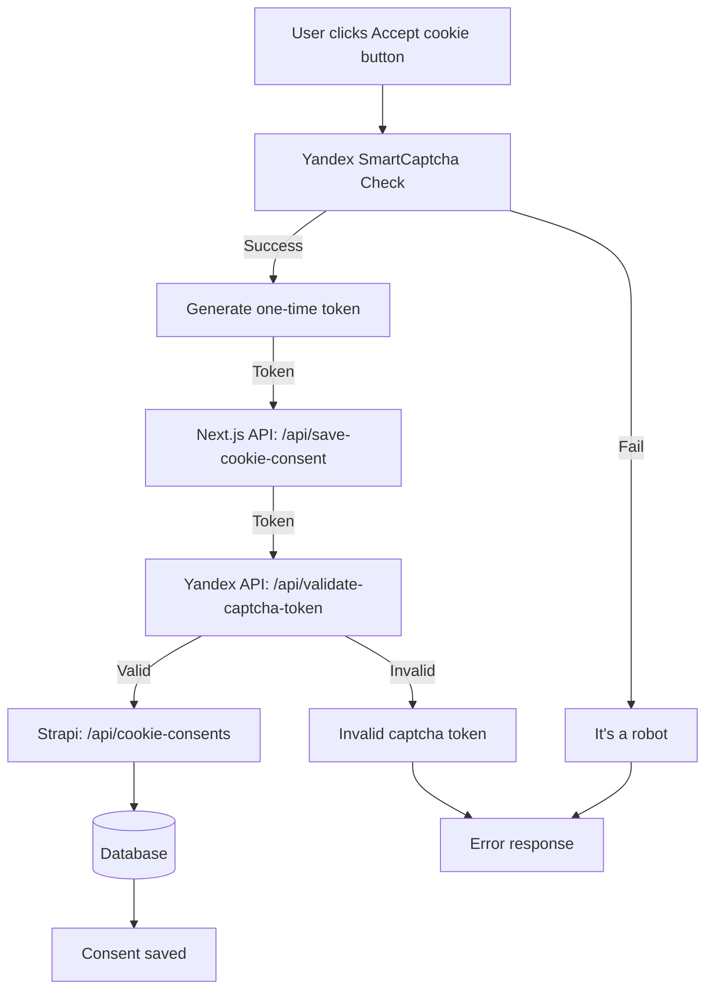

# 004: Storage and collection of cookie consent data

## Status
Accepted (2026-05-25)

## Context
It is necessary to collect and store data about cookie consent according to GDPR.

## Decision
Store consent data in a database (Postgres) inside an existing database for the Strapi CMS, and use the CMS interface to manage consent records.

### Storage schema (table `cookie_consents`)

| Field | Type | Description |
|------|-----|----------|
| `consent_id` | UUID | User ID (generated on the client side). Needed in case we need to prove that the user actually gave consent to cookie processing.
| `created_at` | timestamp | Time of consent (set automatically by the CMS when the record is created). |
| `consent_version` | string | Version of the privacy policy that the user agreed to. |
| `categories` | JSON | Allowed cookie categories (for example: `{"analytics": true, "webvisor": false}`). |

### Generating a consent_id
The consent_id is generated only after getting the user's consent for cookie processing. A special function that creates a random UUID is used to generate it. The generated UUID is saved in the user's browser localStorage. This ensures the ID is stored forever (unless the user manually clears localStorage).

## Consequences:

### Advantages:
- Following GDPR requirements.
- Using existing infrastructure.
- The CMS interface will make it easy to find and delete a record if needed.
- Low risk of data loss, because we have a working database backup system.

### Disadvantages:
- No way to 100% identify the user if consent_id is lost, because there are no other ways to identify them.
- Dependence on the CMS.

## Architectural solution
Below is the sequence of interaction between the user, the captcha, and the API when saving consent for cookie processing.

### SmartCaptcha
To protect against automated threats (including DDoS, bot attacks, mass fake consents, and request forgery), SmartCaptcha with two-level protection has been added:

- **On the client side** — an invisible captcha that analyzes suspicious activity and, if something looks suspicious, gives a task to prove the user is human. It usually does not affect normal users.
- **On the server side** — token validation through the Yandex API.

This architecture completely stops fake requests sent through `curl`, `Postman`, or any other tools for automating HTTP requests. Even if an attacker intercepts the token, it is one-time only and cannot be used again.

Using SmartCaptcha does not violate GDPR requirements even though it starts collecting personal data without the user's consent. This is because we have a legal right to protect the site from malicious attacks. However, we must add a notice about this.

## Alternatives

## Protection methods considered
Before choosing SmartCaptcha, the following protection methods were considered:

### 1. x-api-key
Sending a secret API key in the header of each request.

**Why it is not suitable:** The Next.js endpoint is public. Even if the key is stored in secrets, it still has to be included in the request header to Strapi. In this case, an attacker can still call the public Next.js endpoint, which will automatically add the secret key to the header. There is no real protection here."

### 2. Rate Limit
Limiting the number of requests from one IP or session within a certain period of time.

**Why it is not suitable:**
- Only protects against mass identical requests, but not against a distributed DDoS (attack from thousands of IP addresses)
- Does not solve the case of a conference or presentation, where hundreds of real users open the site at the same time from one IP (corporate Wi-Fi, organizers' office)
- An attacker can bypass the limit by simply slowing down requests to the allowed threshold

### 3. CSRF-token
Generating a unique token for each session, which is checked when the form is submitted.

**Why it is not suitable:**
- CSRF attacks are aimed at performing actions on behalf of an authorized user. We have no authorization or sessions, so there is nothing to steal from cookies.
- Even if we add it, it will only slightly make it harder to send requests through Postman (an attacker would first need to visit the site, then manually copy cookies and the CSRF token from the header).
- Does not protect against DDoS or bot attacks.

## Storing data in a JSON file
Instead of storing data in a database, store it in a local JSON file and append the data there.

Advantages:
- No dependency on the CMS or database.

Disadvantages:
- No convenient interface.
- Higher risk of data loss than with a database.
- Need to set up a backup mechanism.
- Need to design and configure data storage in a readable format.