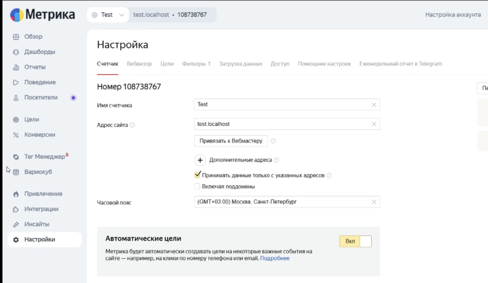

# 005: Cookie Testing

## Status
Proposed

## Context
The system of cookie consent in the project involves the following:

- storing user consent preferences in COOKIE_ACCEPT and COOKIE_SETTINGS
- initialization of Yandex Metrika analytics based on cookie values
- providing a cookie settings modal for more control (analytics and webvisor)
- **cookies-next** library for operations with cookie

## Decision
Currently we have three types of tests:
- **E2E tests** (Playwright) covering accept/reject cookie flows
- **component tests** (Playwright) covering visual part and logic of checkboxes
- **unit tests** (Jest) covering Yandex Metrika loading logic

### Environment Variable
We can use PROD env vars in E2E tests without contaminating Yandex Metrika account with test data. This is possible thanks to the checkbox `Accept data only from specified addresses (Принимать данные только с указанных адресов)` in the dashboard, which protects statistics from spam traffic by only counting visits from domains specified in the settings. This prevents data corruption if the counter code accidentally ends up on other websites. You can enable this feature in the *"Settings"* > *"Counter"* tab.

## Consequences
### Advantages
- critical user flows are covered (accept/reject cookies) 
- UI display and checkbox logic are checked at component level
- initialization of analytics logic is covered by both unit and E2E tests

### Disadvantages
- cookie security attributes are not tested
- cookie expiration is not tested
- cookie persistence after page reload is not tested (only tested manually)

## Alternatives
None considered.