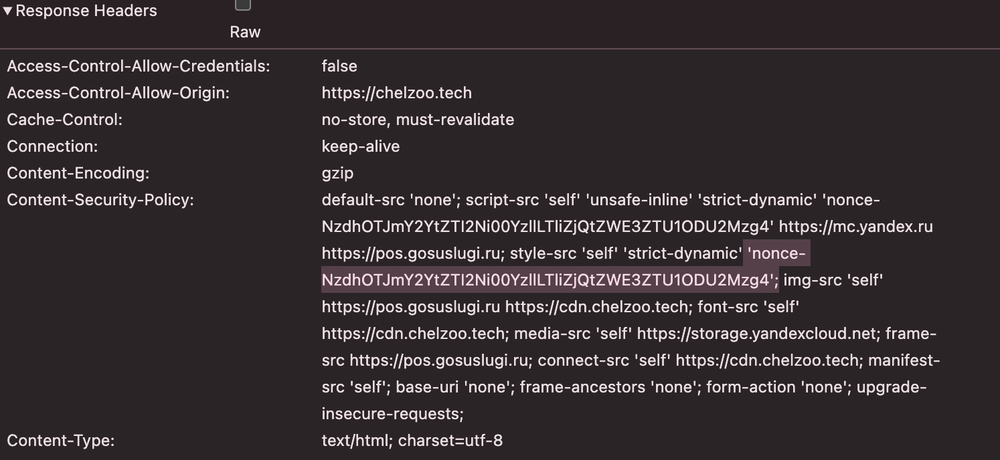
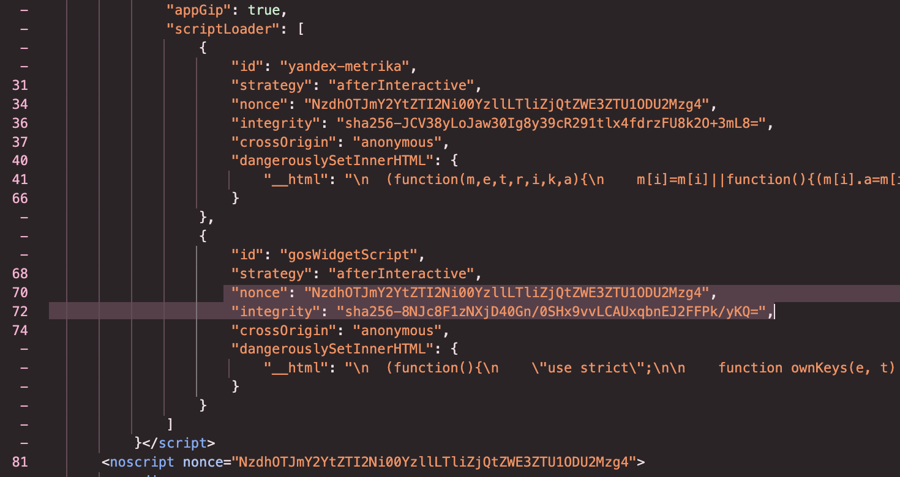
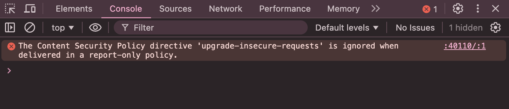

# Content Security Policy

#### Status
Accepted

## Context
Content Security Policy (CSP) is a security mechanism implemented via the Content-Security-Policy HTTP header. It allows you to specify which content sources are permitted on a page. This helps prevent various attacks, such as XSS (Cross-Site Scripting) or the loading of malicious resources. 

#### Purpose of CSP:
- To prevent the execution of malicious scripts that could be injected into a page. For example: If CSP is configured to allow only scripts from a specific domain (script-src 'self' https://trusted-scripts.com), any attempts to execute scripts from other sources will be blocked.

- To ensure the trustworthiness of loaded content by controlling sources for resource loading (scripts, styles, images, etc.). For example, the directive img-src 'self' https://trusted-images.com allows loading images only from your own domain and a trusted service. Loading images from unauthorized sources will be prohibited.

#### List of Directives:
- **default-src** — default source for all resource types except base-uri, frame-ancestors, and form-action

- **script-src** —  sources for loading scripts

- **style-src** —  sources for loading styles

- **img-src** —  sources for loading images

- **connect-src** — sources to which connections are allowed to be established (e.g., for AJAX requests)

- **font-src** — sources for loading fonts

- **media-src** — sources for loading media files (audio and video)

- **frame-src** — sources from which frames are allowed to be loaded

- **manifest-src** — sources for loading application manifests

- **base-uri** —  allowed sources for the `<base>` element 

- **form-action** —  specifies where forms are allowed to be submitted

- **frame-ancestors** — which sources are allowed to embed the current page in a frame

#### Allowed Directive Values:
- **'self'** — allows loading resources only from the same origin (domain)

- **'none'** — prohibits loading resources from any source

- **'unsafe-inline'** - allows execution of inline scripts or styles. Use with caution, as this increases XSS risk

- **'unsafe-eval'** — allows execution of string scripts, e.g., via [eval()](https://developer.mozilla.org/en-US/docs/Web/JavaScript/Reference/Global_Objects/eval). Also should be used with caution

- **URL-адреса** - full URLs (e.g., https://example.com) specifying allowed sources

During development and CSP configuration, it is considered good practice to use the Content-Security-Policy-Report-Only header instead of Content-Security-Policy to catch violations and understand what is still insecure before enabling a strict policy that blocks content.

The main challenge with CSP report was the use of unsafe values:
- 'unsafe-inline' — allows any inline scripts and styles

- 'unsafe-eval' — allows eval()

These unsafe values can only be eliminated by abandoning inline elements, but they are present in the HTML and are necessary for the correct operation of some components. For example, Gosuslugi services scripts and Yandex Metrica scripts, as well as inline loader styles added in _document.tsx for immediate loader display.

Note: These values are typically used only for development, as in our case Next.js adds additional scripts to the page in the dev environment to which we cannot pass a nonce, and CSP blocks them, preventing the page from loading. However, we decided to simply disable CSP for the dev environment.

## Decision
The most common and effective solution is the implementation of nonce or hash:
- **nonce** —  a unique code generated for each request to the page, added to the header and to elements on the page
- **hash** —  a hash of the script's content, if it does not change

### Nonce
For our case, using **nonce** proved to be ideal.

The principle is that only elements with a correct nonce will be executed — an attacker cannot guess or forge the value.

Initially, we tried setting CSP headers at the next.config.js level, hardcoded the nonce, and realized this was incorrect because it needs to be dynamic — different for each request, not generated only once at build time.

We added a middleware.ts file in src/, which implements dynamic nonce generation and CSP header setting. The implementation example was taken from:
- [official Next.js docs](https://nextjs.org/docs/app/guides/content-security-policy)
- [a talk at the React Summit conf](https://gitnation.com/contents/content-security-policy-with-nextjs-leveling-up-your-websites-security/video)

This middleware:
1) generates a nonce
2) inserts it into the CSP header
3) passes it via Request Headers
4) can be used in components for scripts and styles

We then injected the generated **nonce** into script and style tags embedded in HTML within the _document.tsx file.
After this, we removed the 'unsafe-inline' and 'unsafe-eval' values. However, based on Lighthouse recommendations and documentation, we had to keep the 'unsafe-inline' value for script-src in the production version, in case older browsers do not support the nonce approach and elements cannot be displayed without it. In modern browsers, **unsafe-inline**, specified alongside **nonce** together with **strict-dynamic**, is ignored and does not create security holes.

After resolving issues from the Content-Security-Policy-Report-Only report, we switched to the Content-Security-Policy header.

### Hash
We also implemented the use of **hash** for additional protection against modification of our scripts, because while nonce allows the use of scripts from third-party sources, if those sources are compromised and the delivered script is altered, only a hash can detect this.

We decided to generate hashes within our code and added a utility `getHash.ts`, in which we wrote a content hashing function. We call this function in the _document.tsx file and pass it the Gosuslugi services and Yandex Metrica scripts to obtain the hash. The generated hash is then added to the `<script>` attribute in the `integrity` parameter. For example:

```js
<Script
id="yandex-metrika"
strategy="afterInteractive"
nonce={nonce}
integrity={YMetricHash} // generated hash
crossOrigin="anonymous"
dangerouslySetInnerHTML={{
    __html: YMetricScript, // the script itself
}}
/>
```

We also added the `crossOrigin="anonymous"` parameter to the `<script>` attribute, which pairs with `integrity` and allows loading resources from other origins without sending credentials, cookies, etc.

### How Added Nonce and Hash Appear in Browser

This is how the nonce, added to the header, looks in DevTools



This is how the nonce and hash appear in the page's HTML



### Testing

For testing, we are considering implementing a test that sets the Content-Security-Policy-Report-Only header and checks the report for any issues.
There is a minor implementation issue due to the [upgrade-insecure-requests](https://developer.mozilla.org/en-US/docs/Web/HTTP/Reference/Headers/Upgrade-Insecure-Requests) directive in the CSP headers, which instructs the browser to automatically replace all HTTP requests with HTTPS requests.

Content-Security-Policy-Report-Only outputs an error/warning:



This error indicates that the upgrade-insecure-requests directive is ignored because the Content-Security-Policy-Report-Only header is not intended to alter browser behavior, but only to monitor violations.

The solution is to remove the upgrade-insecure-requests directive from the Content-Security-Policy-Report-Only header during testing.

## Alternatives
None considered.

## Consequences
- Third-party scripts and widgets may stop working if they are not explicitly allowed
- Additional support is required when the HTML structure changes or new inline elements appear

## Pros
- Enhanced website security
- Control over used resources and executed code

## Cons
- Increased configuration complexity
- Significant time required for setup and refactoring
 
### Link to PR
https://github.com/TourmalineCore/pelican-ui/pull/345
