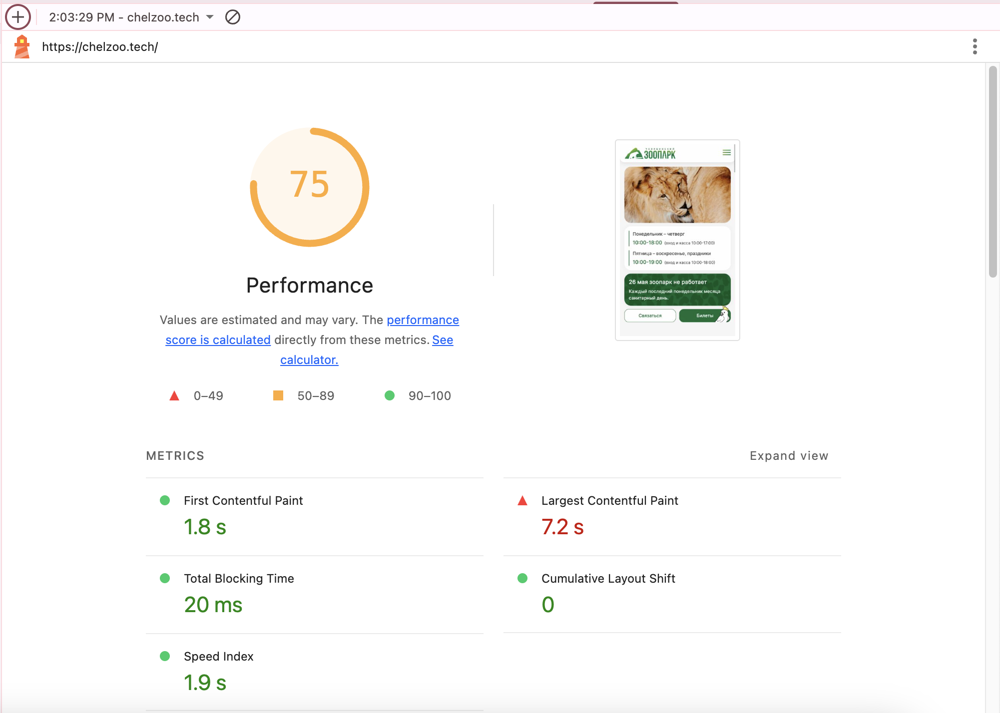
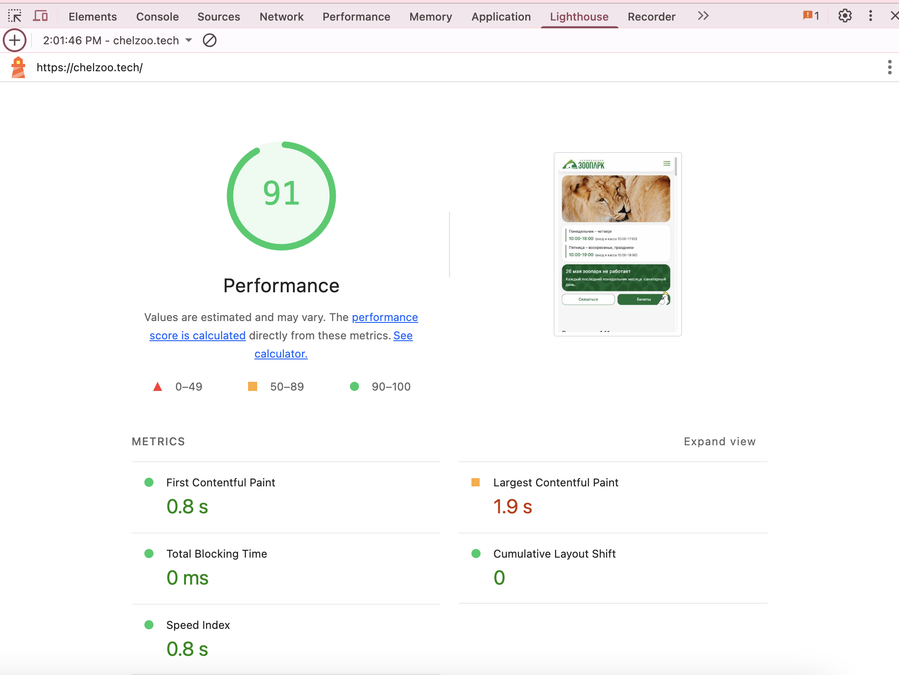

# Steps to Improve Next.js Performance

Lighthouse is a useful tool for automated web page assessment. However, it is not completely accurate and should not be used as the sole means of evaluating site quality. It provides good benchmarks but does not replace manual testing and expert analysis.

Checking performance through the _Lighthouse_ tab in browser developer tools allows you to identify areas where performance metrics can be improved.

Here's what we did to improve these metrics:

## 1. Images

- Compressed images using tools such as https://tinypng.com/ and https://jakearchibald.github.io/svgomg/ to reduce their size without losing quality.

- Set the [`unoptimized`](https://nextjs.org/docs/pages/api-reference/components/image#unoptimized) parameter for SVG files when they are used in the [Image](https://nextjs.org/docs/pages/api-reference/components/image) tag, since Next.js does not optimize vector images, and this explicitly tells it not to waste resources on this.

- Set the [`priority`](https://nextjs.org/docs/pages/api-reference/components/image#priority)  parameter for images that are in the viewport when the page loads. This prioritizes loading critical assets.

- For images that are rendered and enter the viewport only when a popup opens, set the [`loading="eager"`](https://nextjs.org/docs/pages/api-reference/components/image#loading) parameter instead of the default [`loading="lazy"`](https://nextjs.org/docs/pages/api-reference/components/image#loading). This allows such images to start loading as soon as they appear in the DOM tree.

- For optimal image loading at different breakpoints, set the [`sizes`](https://nextjs.org/docs/pages/api-reference/components/image#sizes) parameter for images that use the [`fill`](https://nextjs.org/docs/pages/api-reference/components/image#fill) parameter. For example:
```
<Image 
    fill 
    src="/example.png"
    sizes={(max-width: 767px) 100vw, (max-width: 1365px) 50vw, 33vw)}
/>
```
This tells the browser: <br/>
"If the viewport is less than or equal to 767px, the image should occupy 100% of the viewport width."<br/>
"If the viewport width is between 768px and 1365px, the image should occupy 50% of the viewport width."<br/>
"Otherwise (for viewports from 1366px), the image should occupy 33% of the viewport width."

- Added caching for optimized images using the [minimumCacheTTL](https://nextjs.org/docs/pages/api-reference/components/image#minimumcachettl) parameter.

## 2. Script 

-  Integrated third-party scripts using the `Script` tag from Next.js.

- Added the `strategy='lazyOnLoad'` parameter for scripts that do not affect page loading and functionality, so that they load after the priority content.
For example: 
```js
<Script
    id="yandex-metrika"
    strategy="lazyOnload"
    ...
/>
```

## 3. Other

- Added the `font-display: swap` property for fonts. It sets a very short (less than 100 milliseconds) blocking period and an infinite swap period. With this strategy, the browser almost immediately displays text with a fallback font, and then when the required font loads, it switches to it.

```js
const inter = localFont({
  src: [
    {
      path: '../../public/fonts/Inter-Regular.woff',
      weight: '400',
      style: 'normal',
    },
  ],
  variable: '--font-inter',
  display: 'swap',
});
```

- Used dynamic imports selectively.
For example, for the Gosuslugi banner located at the bottom of the page, which due to the dynamic import renders after all other components imported statically have loaded.
For example:

```js
const GosBanner = dynamic(
  () => import(`../../home-page/GosBanner/GosBanner`).then((component) => component.GosBanner),
  {
    ssr: true,
  },
);
```

- To improve the `Cumulative Layout Shift` metric, which indicates how much page elements shift during loading, added the `min-height: 100vh` CSS property for the main content.

- Adding a loader to the page also played a role, masking potential content shift until the page renders.

## Diagnostic Tools:
- the **Lighthouse** tab in dev tools;
- the **Performance** tab in dev tools, with detailed usage instructions [here](https://www.debugbear.com/blog/lcp-request-discovery);
- the [webpagetest](https://www.webpagetest.org/) website, where you can run site performance tests and obtain various metrics, particularly to check for any blocking scripts.

### Useful Articles:
https://habr.com/ru/companies/fuse8/articles/754684/

These optimizations helped achieve the following metrics (using the main page as an example):<br/>
**Mobile version**
<br/>

**Desktop version**
<br/>
