# Robots.txt and Sitemap

## Introduction: why robots.txt and sitemap.xml files are needed

The robots.txt and sitemap.xml files play an important role in optimizing a website for search engines. These files help search engine crawlers properly index your site, which improves visibility in search results.

### Robots.txt
The robots.txt file is used to control search engine crawler access to the site. It allows you to specify which pages or sections of the site should be indexed and which should not. This is **especially** useful if you want to hide certain pages from indexing, such as pages with confidential information or duplicate content.

Example of our robots.txt:

```
// * Means we hide the page from all crawlers
User-agent: *
// Hide the components page
Disallow: /components

// Our site address
Host: https://chelzoo.ru

// Endpoint that returns the xml file
Sitemap: https://chelzoo.ru/api/get-sitemap
```

### Sitemap.xml
The sitemap.xml file is a site map that helps search engines better understand the structure of your site and more quickly find new or updated pages. Unlike robots.txt, which restricts access, sitemap.xml aims to improve indexing. This file contains a list of all URLs on the site, as well as additional information about each URL, such as the last update date, update frequency, and priority.

### Configuration

#### Configuring robots.txt Generation
To generate robots.txt and the sitemap, the [next-sitemap](https://www.npmjs.com/package/next-sitemap) plugin is used, which generates these files after the project build. Its configuration is located in the `next-sitemap.config.js` file.

Plugin configuration:
```js
module.exports = {
  // Site address
  siteUrl: `https://chelzoo.ru`, 
  // Flag indicating whether to generate robots.txt or not
  generateRobotsTxt: true, 
  // Flag indicating whether to generate sitemap.xml or not. We get the sitemap from Strapi so we disable it
  generateIndexSitemap: false, 
  // To completely disable sitemap generation, exclude everything
  exclude: [`*`], 
  // Object with robotsTxt generation settings
  robotsTxtOptions: {
    // If the ENABLE_SEO_INDEXING flag === true, we enable indexing of all pages except the components page, as it is an internal utility page. If the flag is false, we prohibit indexing the site.
    policies: [
      process.env.ENABLE_SEO_INDEXING === `true` ? {
        userAgent: `*`,
        disallow: [`/components`],
      } : {
        userAgent: `*`,
        disallow: `/`,
      },
    ],
    // If indexing is allowed, connect the server-side sitemap from Strapi
    ...(process.env.ENABLE_SEO_INDEXING === `true` && {
      additionalSitemaps: [`https://chelzoo.ru/api/get-sitemap`],
    }),
  },
};

```

#### Configuring Sitemap.xml in Strapi
The sitemap configuration is done in the cms repository, as our pages depend on the content added to Strapi. The [strapi-5-sitemap-plugin](https://market.strapi.io/plugins/strapi-5-sitemap-plugin) is used to generate the sitemap.

> Important: For the site to start being indexed by search engines, you need to add ENABLE_SEO_INDEXING=true to the .env file in the ui repository.

Go to settings in the sitemap configuration tab.

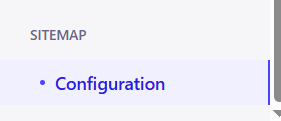

Here you can set the site domain.
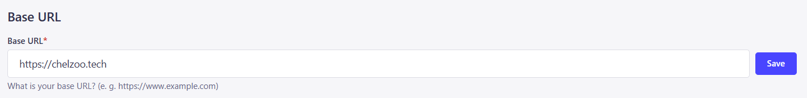

Configuration for collections.
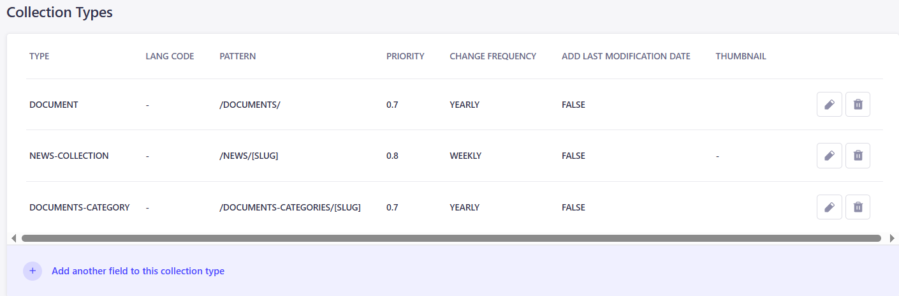

The configuration consists of the following fields:

1. Type - here you select the collection for which you will perform the configuration.
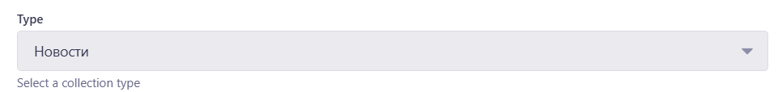

2. Lang Code - in this field, select the appropriate language.
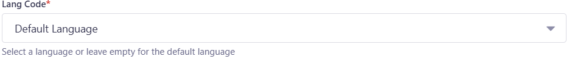

3. Pattern - in this field, configure the link that will be displayed in the sitemap.
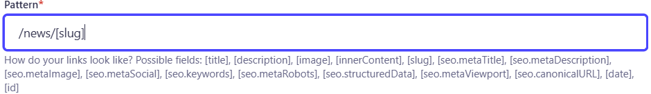

4. Priority - in this field, configure the page priority (from 0.0 to 1.0). Not all search engine crawlers pay attention to this field.
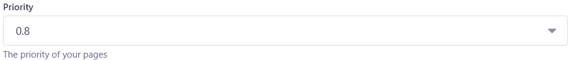

Priority setting recommendations:
- Home page (/) – 1.0

Usually the most important, as it is the entry point for users.

- Key sections and categories – 0.8 – 0.9

Main categories, services, main landing pages.

- Articles, products, subcategories – 0.6 – 0.7

Important, but not as critical as the home page.

- Secondary pages (blog, FAQ, contacts) – 0.4 – 0.5

Useful, but not key for SEO.

- Technical and utility pages – 0.1 – 0.3

Privacy policy, terms of use, etc.

5. Change Frequency - this field is where you select how often the content on this page changes. Google, Yandex, and other search engine crawlers use this information to understand how often they should recheck the page for updates.
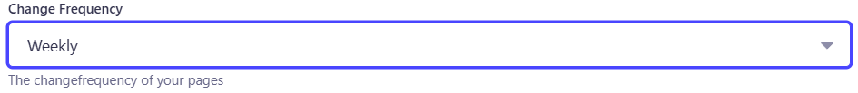

6. Last Modified - adds the last page update date to the sitemap, helping SEO understand which pages need to be reindexed. It is recommended to set this to true.
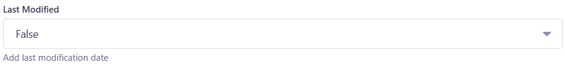

7. Thumbnail - this field allows you to specify an image used to indicate preview images associated with site pages. It is especially useful for visual content, such as online stores, galleries, blogs with images.
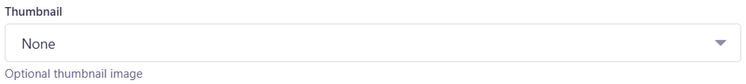

In addition to collections, you can add your own URLs, such as the home page or the contact zoo page.
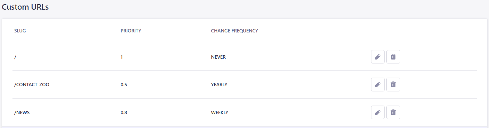
